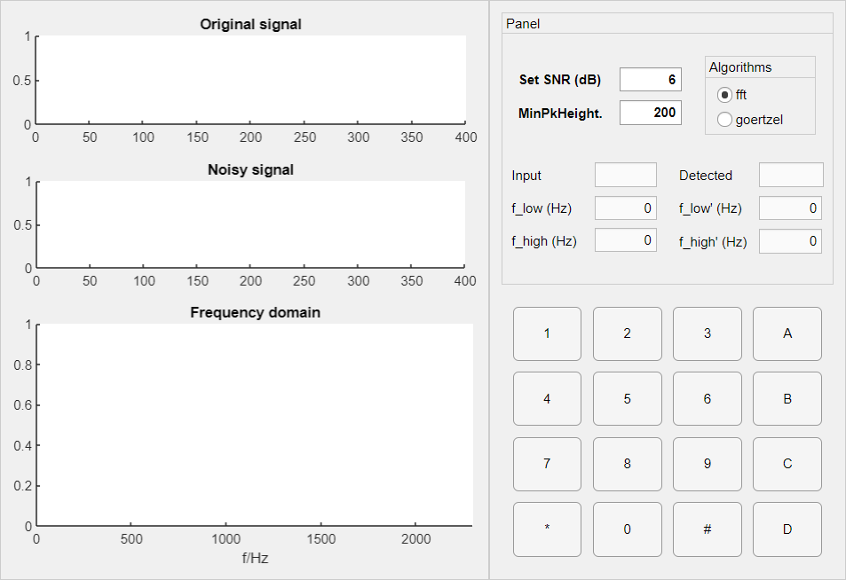

# DTMFDemo

DTMF demo app build by matlab appdesigner

使用AppDesigner构建的DTMF演示程序，平台MATLAB R2019b

## 工程界面截图

## 工程文件

见[Releases](https://github.com/longfish-sama/DTMFDemo/releases)，或[dtmf.mlapp](dtmf.mlapp)

## 关于 dtmf 目录

解压工程文件所得

代码部分可在dtmf/matlab/[document.xml](dtmf/matlab/document.xml)中查看（AppDesigner以xml格式储存编写的代码）
